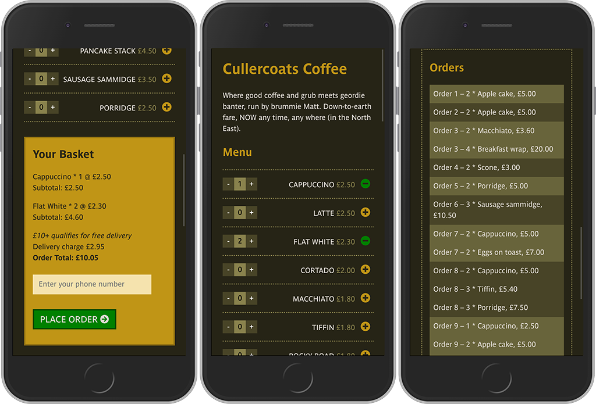

# Cullercoats Coffee

### Order takeaway coffee and snacks online for delivery

**Cullercoats Coffee** is a much-loved cafe in my hometown whose coffee-snacks menu I am using as the basis for an online delivery service. It presents a single page mobile-view menu, drawn from a database of menu items. As the customer you can browse and add one or more items to the basket, which then shows a full breakdown of costs including delivery, and outputs an order id.

The app also provides a view for the cafe-owner so they can see what each incoming order consists of.

---

## Installation and set up

- Clone the project and run `npm install`
- Create your own local PostreSQL database instance and create the tables by running `pgweb` navigating to localhost:8081 and running the query in the `database.sql` file.
- Create a `.env` file with the following variables

```
DB_HOST=localhost
DB_NAME=
DB_USERNAME=
DB_PASSWORD=

```

- Run `npm start` to launch the app and navigate to localhost:8080
- Use `npm run dev -- --watch` to build React
- Navigate to `localhost:8080` in your browser to view

---

### Tech stack

- React
- PostgreSQL
- Node.js
- Express
- Handlebars
- SCSS
- Classnames
- Git

### Build tools

- Webpack
- Babel

### Stages of development

- Plan database tables and relationships [https://dbdiagram.io](https://dbdiagram.io)
- Compile .sql file and create tables with seed data,
- Set up and creat core functionality in React
- SCSS to style the UI
- Implemented functionality for:
  - menu listing page with visual feedback and error messaging for adding / removing items
  - shopping basket
  - free delivery calculation
  - list of incoming orders

### Functionality and features

- Menu items can be added, removed from the basket and increase/decreased in quantity
- Added menu items can be viewed in the basket menu with a breakdown of costs
- A booking can be placed with order ID output

### Desired features with more time

- A booking can then be make by adding your name and number
- Add Twilio functionality - receive a booking confirmation by text with booking ID
- You can view your order by clicking on the member icon entering your order ID
- To calculate the estimated time of delivery based on the customer's location
- To enable customers to track their order on their phone
- Allow customers to amend their order within a limited time period


