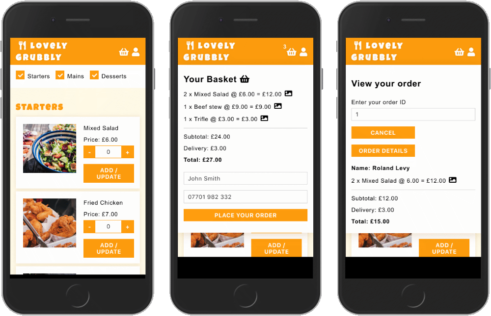

 

# Lovely Grubbly

## Order takeaway food for delivery
**Lovely Grubbly** is an online restaurant which brings the best local food to your doorstep. It allows you to browse the menu and add dishes to the shopping basket which shows a full breakdown of costs including dellivery. To place your order you enter your details and immediatly receive confirmation by text with an order ID.

> [View the repo on Github](https://github.com/OurBnB/OurBnB)

--- 

## Installation and set up
+ Clone the project and run `npm install`
+ Create your own local PostreSQL database instance and create the tables by running `pgweb` navigating to localhost:8081 and running the query in the `database.sql` file.
+ Create a `.env` file with the following variables
```
DB_HOST=localhost
DB_NAME=
DB_USERNAME=
DB_PASSWORD=
TWILIO_SID_TEST=
TWILIO_AUTH_TEST=
TWILIO_SID_LIVE=
TWILIO_AUTH_LIVE=
```

+ Run `npm start` to launch the app and navigate to localhost:8080
+ Use `npm run dev -- --watch` to build React
+ Navigate to `localhost:8080` in your browser to view

### API Keys needed
+ [Twilio API](https://www.twilio.com/docs/libraries/node) - for sending booking confirmation by text

---

### Tech stack
+ React
+ PostgreSQL
+ Node.js
+ Express
+ Handlebars
+ SCSS
+ Classnames
+ Flex-box
+ Git

### Build tools
- Webpack
- Babel

### Stages of development
+ Planned structure of the database tables and their relationships
+ Created database tables, sourced text and image data, entered data into database tables
+ Set up and created the core functionality in React
+ Used SCSS and Flexbox to style the UI
+ Implemented functionality for:
> + menu listing page
> + shopping basket
> + viewing an order

### Functionality and features
+ Food courses, Startes / Mains / Desserts can be filtered 
+ Menu items can be added, removed from the basket and increase/decreased in quantity
+ Added menu items can be viewed in the basket menu with a breakdown of costs
+ Each item has an image icon which is a tooltip showing a preview of the menu item
+ A booking can then be make by adding your name and number 
+ You receive a booking confirmation by text with your booking ID
+ You can view your order by clicking on the member icon entering your order ID

### Desired features with more time
+ To have a responsive layout for tablet and desktop screen sizes
+ To calculate the estimated time of delivery based on the customer's location
+ To enable customers to track their order on their phone
+ Allow customers to amend their order within a limited time period 
